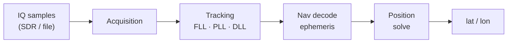
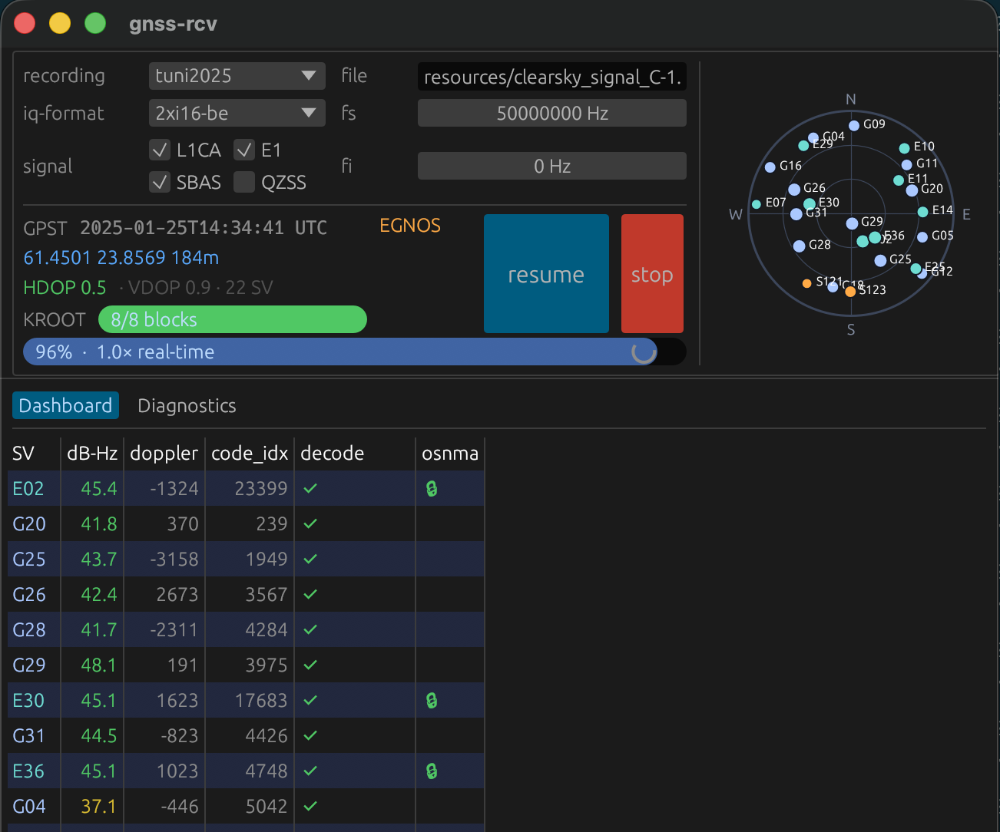
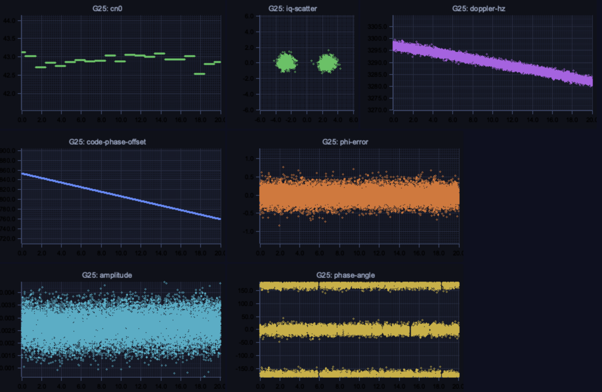

# 🛰️ gnss-rcv — a software-defined GPS + Galileo receiver in Rust

[](https://github.com/mx4/gnss-rcv/actions/workflows/linux.yml)
[](https://github.com/mx4/gnss-rcv/actions/workflows/macos.yml)
[](LICENSE)

Turn raw SDR radio samples into a position fix. `gnss-rcv` implements the full
pipeline from scratch — signal acquisition, tracking, navigation message decoding
and least-squares positioning — for both GPS/QZSS **L1 C/A** and Galileo
**E1-B** (BOC(1,1) + I/NAV), with no GNSS library doing the heavy lifting. Feed it
an IQ recording (several formats / sample rates) or a live rtl-sdr dongle, and it
computes your latitude and longitude — from GPS, from Galileo alone, or a mix.

```console
$ cargo run --release -- -f resources/gpssim_gen_2xi16 -t 2xi16 -x
file: resources/gpssim_gen_2xi16 -- 2xi16 350.4 MiB duration: 44.9 secs
G01: TRCK cn0=51.0 dopp=-2755 code_idx=  80 phi=-0.89 ts_sec=3.001
...
position fix: 46.207328,6.155321 h=0.4km  https://maps.google.com/?ll=46.21,6.16
```

…or a **Galileo-only** fix from the same L1 band with `--sig E1B`:

```console
$ cargo run --release -- -f resources/ION_LimeSDR_Bands-L1.2xi16 \
    -t 2xi16 --fs 10M --fi 420K --sig E1B
E01: Galileo ephemeris complete (GST week 947, toe 63600 s)
...
funnel: searched 36 -> acquired 5 -> tracked 5 -> ephemeris 5 -> used-in-fix 5
position fix: 52.148,4.460 h=0.1km   # 5 SVs (E01/E04/E09/E11/E19), Netherlands
```

## How it works



1. **Acquisition** — an FFT search over code phase × Doppler finds which
   satellites are present and their rough frequency/phase.
2. **Tracking** — carrier (FLL/PLL) and code (DLL) loops lock onto each
   satellite and stay aligned as the signal drifts.
3. **Nav decode** — each satellite's navigation message is demodulated into its
   ephemeris (precise orbit + clock): GPS/QZSS **LNAV** (50 bps, parity-checked
   subframes) or Galileo **E1-B I/NAV** (250 sym/s → de-interleave → rate-1/2
   Viterbi → CRC-24Q pages).
4. **Position solve** — pseudoranges from ≥4 satellites are combined into a
   single-point position fix via [gnss-rtk](https://github.com/rtk-rs/gnss-rtk),
   with the correct µ / time scale (WGS-84/GPST or GTRF/GST) per constellation.

The whole chain is exercised end-to-end by an integration test that simulates a
recording for a chosen date/location and checks the receiver recovers it (see
[Simulate a recording](#simulate-a-recording)).

## Quickstart

```sh
cargo build --release

# Get a recording — either download a real capture...
./resources/fetch.py nov3          # 12.7 GiB real rtl-sdr capture (2xf32)
# ...or simulate one (needs gps-sdr-sim; downloads the ephemeris for you):
./resources/gen_gpssim.py          # ~350 MiB, Geneva, ends in a verified fix

# Run the receiver until it computes the first position fix:
cargo run --release -- -f resources/gpssim_gen_2xi16 -t 2xi16 -x
```

With no `-f`, it runs against the default development recording (2xf32,
2.046 MHz, zero IF).

## Screenshots

The live UI (`-u`) shows real-time tracking status, a sky plot, and per-SV
diagnostics:



The receiver also writes a diagnostic web page (`plots/index.html` + images,
enabled with `-p`) showing the decoder's internal state per satellite:



## Usage

```sh
$ RUST_LOG=info cargo run --release -- -f path/to/recording.bin -t <format>
```

### Supported IQ formats (`-t`)
| `-t`          | sample layout                                       |
|---------------|-----------------------------------------------------|
| `2xf32`       | interleaved float32 I/Q (default)                   |
| `2xi16`       | interleaved int16 I/Q (e.g. `gps-sdr-sim -b 16`)    |
| `2xi8`        | interleaved signed int8 I/Q (e.g. HackRF)           |
| `i8`          | single int8, real-only                              |
| `rtlsdr-file` | interleaved uint8 I/Q (an `rtl_sdr` capture)        |
| `1bit`        | 8 hard-limited 1-bit real samples packed per byte   |
| `4bit`        | 2 signed 4-bit real samples packed per byte (SX3)   |

### Sample rate & intermediate frequency
The PRN code is resampled to the actual rate, so any sampling frequency works.
Set the rate with `--fs` and the intermediate frequency with `--fi` (in Hz, or
with a K/M/G suffix — `--fs 10M --fi 420K`; default 2.046 MHz / 0 Hz):
```sh
# 1-bit real recording sampled at 5.456 MHz (IF 4.092 MHz aliases to 1.364 MHz):
$ cargo run --release -- -f resources/gps.samples.1bit.I.fs5456.if4092.bin \
    -t 1bit --fs 5456000 --fi 1364000
```

### Other useful options
- `--sig <signal>`: which signal to receive — `L1CA` (GPS/QZSS, default) or
  `E1B` / `E1C` (Galileo E1). Selecting `E1B` switches the whole chain to the
  4 ms BOC(1,1) code and Galileo I/NAV decode, and **automatically verifies
  Galileo OSNMA** message authentication (anti-spoofing) — the trust anchor is
  picked from the decoded epoch (2023/2024/2025). See [docs/osnma.md](docs/osnma.md).
- `--e1c` (experimental): use the Galileo E1-C pilot. Two modes:
  - With `--sig E1B`: **combined** channel — the pilot folds into the data
    channel. Its 4-quadrant PLL drives the carrier (also disambiguating the E1-B
    data sign, so no half-rate false lock on the data), the DLL combines E1-B+E1-C,
    and E1-B still carries I/NAV. One measurement/ephemeris per SV.
  - With `--sig E1C`: **standalone** pilot — tracking-quality assessment only
    (dataless, no fix). Cuts carrier-phase jitter ~40% vs E1-B at equal C/N0.

  CS25 sync waits out the half-rate window; coherent length is tunable via
  `GNSS_E1C_COH_MS` (default 20 ms).
- `--num-msec N` / `--off-msec N`: process only N ms, or start N ms into the file.
- `--sats 1,11,30`: restrict acquisition to a subset of PRNs.
- `-p` / `--plots`: write per-SV diagnostic PNGs to `plots/` (off by default).
- `-x` / `--exit-on-fix`: stop as soon as the first position fix is computed.
- `--json <path>`: write a machine-readable end-of-run summary (fix, funnel,
  per-SV table, work counters) to `<path>` — `-` means stdout, so it pipes
  straight into `jq`. A file target still prints the human stats to stdout.
- `-u`: open the UI; `-l <file>`: also write logs to a file.

The JSON mirrors the `===== run stats =====` block, e.g.:
```sh
$ cargo run --release -- -f resources/gpssim_2xi16 -t 2xi16 -x --json - | jq '.fix'
{ "lat": 46.2066, "lon": 6.1540, "alt_m": 622.6, "n_sv": 5 }
```
This is what turns a run into an assertion (truth check, regression diff) instead
of grepping logs.

## Getting sample data

### Download an existing recording
Use the helper script to fetch downloadable recordings into `resources/`:
```sh
$ ./resources/fetch.py            # list what's available (with constellation tags)
$ ./resources/fetch.py nov3       # the main dev recording (2xf32, 12.7 GiB)
$ ./resources/fetch.py cttc       # gnss-sdr's CTTC Spain capture (2xi16, ~1.1 GiB)
$ ./resources/fetch.py qzss       # every recording carrying QZSS (a tag, not a name)
$ ./resources/fetch.py all        # everything
```
Each recording is tagged by the constellations in its samples — `gps` (all),
`qzss` (verified present), `galileo` (E1-B decoded; the LimeSDR capture yields a
Galileo-only fix with `--sig E1B`). A positional argument can be a recording name,
a tag, or `all`; `--tag <t>` filters the listing.
The recording used for most of the development is `nov_3_time_18_48_st_ives`
([gypsum release](https://github.com/codyd51/gypsum/releases/download/1.0/nov_3_time_18_48_st_ives.zip),
unzip into `resources/`, `-t 2xf32`). Another good one is gnss-sdr's classic
[CTTC Spain capture](https://sourceforge.net/projects/gnss-sdr/files/data/2013_04_04_GNSS_SIGNAL_at_CTTC_SPAIN.tar.gz)
(complex int16, 4 MHz, `-t 2xi16 --fs 4000000`). A few other online SDR captures
at 1575.42 MHz:
- https://jeremyclark.ca/wp/telecom/rtl-sdr-for-satellite-gps/
- https://s-taka.org/en/gnss-sdr-with-rtl-tcp/
- https://destevez.net/2022/03/timing-sdr-recordings-with-gps/

Details on every recording: [resources/README.md](./resources/README.md).

### Recordings tried
Real-world IQ captures gnss-rcv has been run against, the exact settings, and the
result (a ✅ fix is the computed lat/lon vs. the recording's true location):

| recording | get it | settings | result |
|---|---|---|---|
| `gpssim_2xi16` (Geneva, simulated) | `gen_gpssim.py` | `-t 2xi16` | ✅ **46.207, 6.156** (truth 46.2075, 6.1557) |
| `nov_3_time_18_48_st_ives` | `fetch.py nov3` | `-t 2xf32` | ✅ **52.334, −0.081** — St Ives, Cambs UK |
| CTTC Spain 2013 | `fetch.py cttc` | `-t 2xi16 --fs 4000000` | ✅ **41.274, 1.986** — Castelldefels |
| ION rooftop RTL-SDR | `fetch.py ion-rtlsdr` | `-t rtlsdr-file --fs 2048000` | ✅ **52.177, 4.489** — Netherlands |
| ION LimeSDR (10 MHz, IF 420 kHz) | `fetch.py ion-lime` | `-t 2xi16 --fs 10000000 --fi 420000` | ✅ **52.177, 4.488** — Netherlands (non-zero IF) |
| ↳ same capture, **Galileo E1-B** | (as above) | `… --sig E1B` | ✅ **52.177, 4.490** — Galileo-only fix, 5 SVs (E01/E04/E09/E11/E19), ~110 m from the GPS truth |
| [TEXBAT](https://rnl-data.ae.utexas.edu/datastore/texbat/) `cleanStatic` | manual (44 GB; ~70 s prefix is enough) | `-t 2xi16 --fs 25000000` | ✅ **30.287, −97.736** — Austin TX |
| `GPS-L1-2022-03-27.sigmf-data` | `fetch.py zenodo-sigmf` | `-t 2xi16 --fs 4000000` | tracks (G31 ≈ 45 dB-Hz); ~15 s — too short for a fix |
| ION BladeRF (10 MHz) | `fetch.py ion-bladerf` | `-t 2xi16 --fs 10000000` | tracks 13 SVs (≥40 dB-Hz); ~13 s — too short for a fix |
| ION SJTU L1/E1 (SX3, 4-bit) | `fetch.py sjtu` | `-t 4bit --fs 25000000 --fi 6250000` | Shanghai 🇨🇳 — tracks 15–29 SVs (45–50 dB-Hz), decodes subframes; 60 s but bit-sync too slow for a full ephemeris |
| [PocketSDR](https://github.com/tomojitakasu/PocketSDR) L1/L6 (Tokyo) | `fetch.py pocketsdr` | `-t i8 --fs 12000000 --fi 3000000 --qzss` | Tokyo 🇯🇵 — tracks 26 GPS + QZSS J194/J195/J199; decodes SF2–5 but ~30 s ends ~6 s short of an ephemeris |
| ION HackRF (10 MHz, IF 420 kHz) | `fetch.py ion-hackrf` | `-t 2xi8 --fs 10000000 --fi 420000` | tracks 11 SVs (45–51 dB-Hz), decodes some ephemeris; no full fix yet (intermittent nav decode — open) |
| `gps.samples.1bit…` | `fetch.py jks-1bit` | `-t 1bit --fs 5456000 --fi 1364000` | tracks ~7 SVs at a marginal ~30 dB-Hz; no fix |
| `gioveAandB_short.bin` | [gfix.dk](http://gfix.dk/matlab-gnss-sdr-book/gnss-signal-records/) (by hand) | `-t i8 --fs 16367600 --fi 4130400` | acquires/tracks; short — no fix |

Adding `--sig E1B` decodes Galileo E1-B I/NAV on the wideband captures too (e.g.
PocketSDR Tokyo: 7 SVs decode CRC-valid pages; SJTU Shanghai similarly) — the
LimeSDR capture above is the one long enough to complete ≥4 ephemerides and fix.

The [ION SDR sample collection](https://sdr.ion.org/api-sample-data.html) has more
L1 captures (BladeRF, HackRF, LimeSDR, SiGe…), each with a `.sdrx` metadata file
giving the rate/format/IF to map onto `-t`/`--fs`/`--fi`.

### Simulate a recording
[gps-sdr-sim](https://github.com/osqzss/gps-sdr-sim) generates an IQ recording
for a chosen date and location (2× int16 per sample, use `-t 2xi16`):
```sh
$ ./gps-sdr-sim -b 16 -d 45 -t 2026/04/28,17:00:00 -l 46.2075,6.1557,375 \
    -e brdc1180.26n -s 2046000          # Geneva, Jet d'Eau
```
`./resources/gen_gpssim.py [date,time] [lat,lon,alt]` automates this end-to-end:
it downloads the matching broadcast ephemeris and runs gps-sdr-sim for you.

## Using an rtl-sdr device

> **WIP / caveat:** I haven't been able to identify satellites from my *own*
> rtl-sdr dongle live yet. But gnss-rcv **does** get a fix from a real rtl-sdr
> *recording* (the ION `ion-rtlsdr` sample above, `-t rtlsdr-file`), so the
> receiver's rtl-sdr path works — the live-dongle trouble is almost certainly my
> hardware/antenna/setup, not the code. The recording-file path is the
> well-tested one.

Install librtlsdr first: `sudo apt install librtlsdr-dev` (Linux) or
`brew install librtlsdr` (macOS).

<details>
<summary>Run directly off a connected dongle (<code>-d</code>)</summary>

With an rtl-sdr dongle and a GPS L1 antenna:
```sh
$ RUST_LOG=warn cargo run --release -- -d
```
</details>

<details>
<summary>Stream from a remote dongle over <code>rtl_tcp</code> (<code>-s</code>)</summary>

Run `rtl_tcp` on the host with the dongle, then connect from gnss-rcv on another
host (it auto-configures sample rate, center frequency, etc.):
```sh
$ rtl_tcp -a                                       # on the device host
$ RUST_LOG=warn cargo run --release -- -s <hostname>
```
</details>

<details>
<summary>Record to a file for later replay</summary>

```sh
$ rtl_biast -d 0 -b 1                               # power the GPS/LNA antenna
$ rtl_sdr -f 1575420000 -s 2046000 -n 20460000 output.bin   # 10 s of L1
```
</details>

## Resources
- [RTL-SDR](https://www.rtl-sdr.com/buy-rtl-sdr-dvb-t-dongles/)
- [Software Defined GPS](https://www.ocf.berkeley.edu/~marsy/resources/gnss/A%20Software-Defined%20GPS%20and%20Galileo%20Receiver.pdf)
- [GPS-SDR-SIM](https://github.com/osqzss/gps-sdr-sim)
- [Python GPS software: Gypsum](https://github.com/codyd51/gypsum)
- [SWIFT-NAV](https://github.com/swift-nav/libswiftnav)
- [Raw GPS Signal](http://www.jks.com/gps/gps.html)
- [PocketSDR](https://github.com/tomojitakasu/PocketSDR/)

### General info about GNSS
- [GPS Spec: IS-GPS-200N.pdf](https://www.gps.gov/technical/icwg/IS-GPS-200N.pdf)
- [GPS visualisation](https://ciechanow.ski/gps/)
- [GPS signal](https://www.e-education.psu.edu/geog862/node/1407)

## Contributing
Any code contribution is welcome!

## TODO
Short list; the detailed, evidence-ranked backlog + feature roadmap live in
[AGENTS.md](AGENTS.md).
- [x] QZSS L1 C/A (acquires, tracks, decodes and solves through the GPS path)
- [x] SBAS L1 — **decodes EGNOS/WAAS messages** (`--sbas`; shared C/A tracking →
      streaming Viterbi + CRC-24Q in [`sbas_l1.rs`](src/sbas_l1.rs)). On the CTTC
      Spain capture, EGNOS S120/S126 decode message types 0/1/2/3/4/24/25/26/27.
      (Applying the corrections to improve the fix is future work.)
- [x] Saastamoinen troposphere correction in the solver
- [x] Hermetic synthetic-signal tests ([`src/synth.rs`](src/synth.rs) — multi-SV
      L1CA with Doppler / C/N0 noise, no recording needed)
- [x] Galileo E1 — **acquires + tracks + decodes I/NAV + extracts the ephemeris +
      solves a Galileo-only fix** (E1-B memory codes + BOC(1,1); `--sig E1B` decodes
      real CRC-valid I/NAV words, reconstructs valid orbits, and the GST time + orbit
      feed gnss-rtk). On the LimeSDR capture all 5 tracked SVs (E01/E04/E09/E11/E19)
      complete an ephemeris and produce a fix **~110 m from the site truth
      (52.177, 4.488, Netherlands)** (after the E1 BOC DLL-lag compensation).
- [ ] **combined GPS + Galileo fix** — track both signals in one run and solve
      them together (more SVs, better geometry, a cross-check on each constellation)
- [ ] BeiDou B1
- [ ] test + fix live rtl-sdr device support
- [ ] use the decoded almanac to predict which satellites are in view
- [x] resolve the per-SV pseudorange bias — it was the **DLL code-loop group
      delay**; compensated by `(doppler/fc)·τ` → GPS fix **~4 m** (gpssim), **~20 m**
      (CTTC, real)
- [ ] era-aware GPS week-rollover
