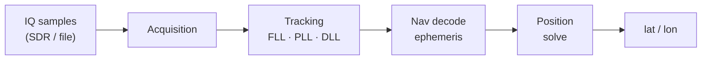

# 🛰️ gnss-rcv — a software-defined GPS receiver in Rust

[](https://github.com/mx4/gnss-rcv/actions/workflows/linux.yml)
[](https://github.com/mx4/gnss-rcv/actions/workflows/macos.yml)
[](LICENSE)

Turn raw SDR radio samples into a position fix. `gnss-rcv` implements the full
GPS **L1 C/A** pipeline from scratch — signal acquisition, tracking, navigation
message decoding and least-squares positioning — with no GNSS library doing the
heavy lifting. Feed it an IQ recording (several formats / sample rates) or a live
rtl-sdr dongle, and it computes your latitude and longitude.

```console
$ cargo run --release -- -f resources/gpssim_gen_2xi16 -t 2xi16 -x
file: resources/gpssim_gen_2xi16 -- 2xi16 350.4 MiB duration: 44.9 secs
G01: TRCK cn0=51.0 dopp=-2755 code_idx=  80 phi=-0.89 ts_sec=3.001
...
position fix: 46.207328,6.155321 h=0.4km  https://maps.google.com/?ll=46.21,6.16
```

## How it works



1. **Acquisition** — an FFT search over code phase × Doppler finds which
   satellites are present and their rough frequency/phase.
2. **Tracking** — carrier (FLL/PLL) and code (DLL) loops lock onto each
   satellite and stay aligned as the signal drifts.
3. **Nav decode** — the 50 bps navigation message is demodulated; three
   subframes yield each satellite's ephemeris (its precise orbit + clock).
4. **Position solve** — pseudoranges from ≥4 satellites are combined into a
   single-point position fix.

The whole chain is exercised end-to-end by an integration test that simulates a
recording for a chosen date/location and checks the receiver recovers it (see
[Simulate a recording](#simulate-a-recording)).

## Quickstart

```sh
cargo build --release

# Get a recording — either download a real capture...
./resources/fetch.sh nov3          # 12.7 GiB real rtl-sdr capture (2xf32)
# ...or simulate one (needs gps-sdr-sim; downloads the ephemeris for you):
./resources/gen_gpssim.sh          # ~350 MiB, Geneva, ends in a verified fix

# Run the receiver until it computes the first position fix:
cargo run --release -- -f resources/gpssim_gen_2xi16 -t 2xi16 -x
```

With no `-f`, it runs against the default development recording (2xf32,
2.046 MHz, zero IF).

## Screenshots

As it processes the IQ data, the receiver periodically writes a diagnostic web
page (`plots/index.html` + images, enabled with `-p`) showing the decoder's
internal state:


There is also a live UI (`-u`):


## Usage

```sh
$ RUST_LOG=info cargo run --release -- -f path/to/recording.bin -t <format>
```

### Supported IQ formats (`-t`)
| `-t`          | sample layout                                       |
|---------------|-----------------------------------------------------|
| `2xf32`       | interleaved float32 I/Q (default)                   |
| `2xi16`       | interleaved int16 I/Q (e.g. `gps-sdr-sim -b 16`)    |
| `i8`          | single int8, real-only                              |
| `rtlsdr-file` | interleaved uint8 I/Q (an `rtl_sdr` capture)        |
| `1bit`        | 8 hard-limited 1-bit real samples packed per byte   |

### Sample rate & intermediate frequency
The PRN code is resampled to the actual rate, so any sampling frequency works.
Set the rate with `--fs` and the intermediate frequency with `--fi` (both in Hz,
default 2.046 MHz / 0 Hz):
```sh
# 1-bit real recording sampled at 5.456 MHz (IF 4.092 MHz aliases to 1.364 MHz):
$ cargo run --release -- -f resources/gps.samples.1bit.I.fs5456.if4092.bin \
    -t 1bit --fs 5456000 --fi 1364000
```

### Other useful options
- `--num-msec N` / `--off-msec N`: process only N ms, or start N ms into the file.
- `--sats 1,11,30`: restrict acquisition to a subset of PRNs.
- `-p` / `--plots`: write per-SV diagnostic PNGs to `plots/` (off by default).
- `-x` / `--exit-on-fix`: stop as soon as the first position fix is computed.
- `-u`: open the UI; `-l <file>`: also write logs to a file.

## Getting sample data

### Download an existing recording
Use the helper script to fetch downloadable recordings into `resources/`:
```sh
$ ./resources/fetch.sh          # list what's available
$ ./resources/fetch.sh nov3     # the main dev recording (2xf32, 12.7 GiB)
$ ./resources/fetch.sh all      # everything
```
The recording used for most of the development is `nov_3_time_18_48_st_ives`
([gypsum release](https://github.com/codyd51/gypsum/releases/download/1.0/nov_3_time_18_48_st_ives.zip),
unzip into `resources/`, `-t 2xf32`). A few other online SDR captures at
1575.42 MHz:
- https://jeremyclark.ca/wp/telecom/rtl-sdr-for-satellite-gps/
- https://s-taka.org/en/gnss-sdr-with-rtl-tcp/
- https://destevez.net/2022/03/timing-sdr-recordings-with-gps/

Details on every recording: [resources/README.md](./resources/README.md).

### Simulate a recording
[gps-sdr-sim](https://github.com/osqzss/gps-sdr-sim) generates an IQ recording
for a chosen date and location (2× int16 per sample, use `-t 2xi16`):
```sh
$ ./gps-sdr-sim -b 16 -d 45 -t 2026/04/28,17:00:00 -l 46.2075,6.1557,375 \
    -e brdc1180.26n -s 2046000          # Geneva, Jet d'Eau
```
`./resources/gen_gpssim.sh [date,time] [lat,lon,alt]` automates this end-to-end:
it downloads the matching broadcast ephemeris and runs gps-sdr-sim for you.

## Using an rtl-sdr device

> **WIP / caveat:** I haven't been able to identify satellites using rtl-sdr
> directly with my hardware setup — unclear whether it's a bug or my setup.
> The recording-file path above is the well-tested one.

Install librtlsdr first: `sudo apt install librtlsdr-dev` (Linux) or
`brew install librtlsdr` (macOS).

<details>
<summary>Run directly off a connected dongle (<code>-d</code>)</summary>

With an rtl-sdr dongle and a GPS L1 antenna:
```sh
$ RUST_LOG=warn cargo run --release -- -d
```
</details>

<details>
<summary>Stream from a remote dongle over <code>rtl_tcp</code> (<code>-s</code>)</summary>

Run `rtl_tcp` on the host with the dongle, then connect from gnss-rcv on another
host (it auto-configures sample rate, center frequency, etc.):
```sh
$ rtl_tcp -a                                       # on the device host
$ RUST_LOG=warn cargo run --release -- -s <hostname>
```
</details>

<details>
<summary>Record to a file for later replay</summary>

```sh
$ rtl_biast -d 0 -b 1                               # power the GPS/LNA antenna
$ rtl_sdr -f 1575420000 -s 2046000 -n 20460000 output.bin   # 10 s of L1
```
</details>

## Resources
- [RTL-SDR](https://www.rtl-sdr.com/buy-rtl-sdr-dvb-t-dongles/)
- [Software Defined GPS](https://www.ocf.berkeley.edu/~marsy/resources/gnss/A%20Software-Defined%20GPS%20and%20Galileo%20Receiver.pdf)
- [GPS-SDR-SIM](https://github.com/osqzss/gps-sdr-sim)
- [Python GPS software: Gypsum](https://github.com/codyd51/gypsum)
- [SWIFT-NAV](https://github.com/swift-nav/libswiftnav)
- [Raw GPS Signal](http://www.jks.com/gps/gps.html)
- [PocketSDR](https://github.com/tomojitakasu/PocketSDR/)

### General info about GNSS
- [GPS Spec: IS-GPS-200N.pdf](https://www.gps.gov/technical/icwg/IS-GPS-200N.pdf)
- [GPS visualisation](https://ciechanow.ski/gps/)
- [GPS signal](https://www.e-education.psu.edu/geog862/node/1407)

## Contributing
Any code contribution is welcome!

## TODO
- [ ] use anise for Ephemerides and Almanac
- [ ] use anise to compute SV position from keplerian elements
- [ ] test + fix rtlsdr support
- [ ] support SBAS, Galileo, QZSS, BeiDou
- [ ] use the received Almanac to decide which satellites are in view
